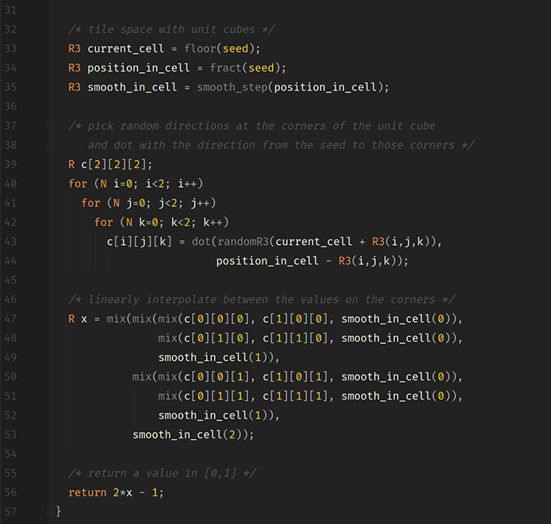

## 🚧 UNDER CONTRUCTION 👷

Credits: There are a lot of in-line references to the places where I learned about the various techniques I adapted. In particular, credit goes to Inigo Quilez and his amazing creative and expository work on raymarching:
 - https://iquilezles.org/www/articles/raymarchingdf/raymarchingdf.htm

Briefly, raymarching is a technique where ray-geometry intersections are not calculated analytically, but via a 'marching' process whereby rays jump incrementally ('march') into the scene. The underlying geometry is implemented as a single function; a Signed Distance Function which takes as argument a point in space and returns the distance from that point to the nearest point on surface of the geometry. Each ray begins at the camera. We evaluate the SDF at that point, and then travel along the ray the returned distance, and then repeat the process until the distance becomes negative, indicating that we're now inside the geometry.

The fact that all geometry is determined by a signed distance function opens up the opportunity to transform that function in interesting ways, obtaining a variety of visually intriguing effects very easily and relatively cheaply.

Features include:

1. CPU parallelization with OpenMP

2. Soft shadows (See shade.cpp for technical explanation)

3. Ambient occlusion (See shade.cpp for technical explanation)

4. Constructive solid geometry, including subtraction, union, and smoothed union (you can see this where the columns meet the plain)

5. Instancing via domain operations (the rings of columns and objects are single objects with domain distortions applied, see domain.cpp)

6. All operations on SDFs are implemented as higher-order functions, enabling a composition/combinator-style programming approach. This was my personal innovation, which was a mistake since I've had trouble convincing the compiler to consistently inline lambdas... See everything in the SDF folder, which will appear pretty to functional programming partisans but probably revolting to everyone else. See field.cpp for the actual scene which is implemented with (a subsection of) those combinators.

